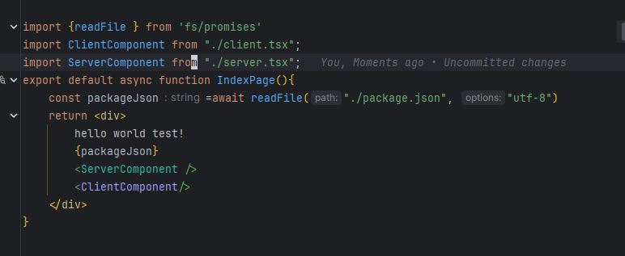

# vite plugin next app router

Setup project like next.js app router with Server Component in Vite
```tsx
export default async function Page() {
    await foo();
    return <div>Page</div>;
}
```




## Run Demo
    
```bash
pnpm install
pnpm build
pnpm pack
cd demo
pnpm install
pnpm dev # or build <- ssg build
```


### Features

- [x] Server Component (async component)
- [x] APP Router
- [x] SSG
- [x] Path Params
- [X] Layout
- [X] Export metadata like next.js
- [X] Export Static Site with getStaticProps


### TODO
- [ ] Dynamic metadata


### FAQ

- I want to use this project for production, is it safe?
  - No, it's not safe, it's just a demo project, But I wish to make it safe in the future.
- How can I contribute?
  - You can contribute by creating a PR, or open an issue. This project hasn't a pr template and another rule, so feel free to contribute. 
- How can I run the demo?
  - Please read the `Run Demo` section in the README.md file.
- Why do you make this project?
  - I want to make a project like next.js with Vite, and I want to use Server Component in Vite, so I make this project.
  - I realized that I can't finish this project alone, so I make it public, and I hope someone can help me to finish this project.
- Your code style is so bad, why?
  - I'm sorry, But i don't have a much time to make a good code style, just make it work first with sort code style.
- Can I use this project for my project?
  - Yes, you can use it, but it's not safe for production, and I don't recommend it.
